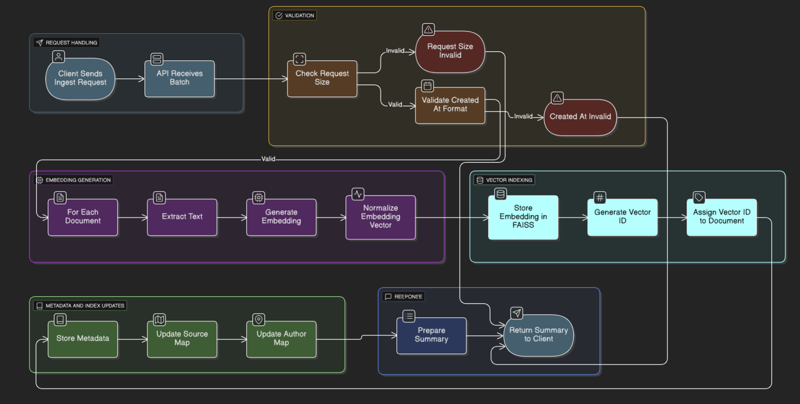
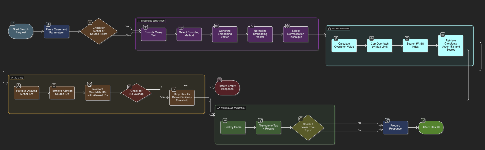

# Semantic Search Service Design

## 1. System Architecture

- The Semantic Search Service is designed as a lightweight, modular API that supports document ingestion and semantic search with metadata filtering.
- The system combines embedding-based vector similarity with inverted indexes for metadata filters to achieve fast and relevant results.

---

## 2. High-Level Flow

### a. Ingestion (`/ingest`)

- Client sends a batch of documents (`id`, `source`, `author`, `text`, `created_at`).
- If request size exceeds the configured threshold, the request is rejected.
- Otherwise, the payload is chunked into batches for processing.
- For each document:
    - The `text` field is embedded using a SentenceTransformer model (`all-MiniLM-L6-v2`).
    - Embedding is normalized and indexed into a FAISS `IndexFlatIP` index (cosine similarity).
    - Document metadata (`id`, `source`, `author`, etc.) is stored in a metadata store.
    - Two inverted indexes are maintained:
        - `source_map`: maps source -> set(vector_ids)
        - `author_map`: maps author -> set(vector_ids)
    - These allow O(1) retrieval of candidate IDs during search.

### b. Search (`/search`)

- Client submits a query string + optional filters (`source`, `author`) + desired `top_k`.
- Query is embedded using the same model and normalized.
- A vector search is performed on FAISS (overfetching `top_k * multiplier` candidates).
- Candidate results are filtered:
    - By metadata filters (`source_map`, `author_map`) in O(1).
    - By similarity threshold (to remove weak matches).
- Final top-k documents are returned, including their score and metadata.

---

## 3. API Design

### a. `POST /ingest`
- Ingests a batch of documents into the semantic search index. Each document is embedded, indexed in FAISS, and mapped with metadata.
- Efficient, avoids multiple round-trips for many documents.

#### Validation Checks
- Rejects requests exceeding batch size threshold (protects from overload).
- Ensures `created_at` is ISO8601 for consistency.

#### Request Body Example
```json
[
    {
        "id": "a1b2c3d4-e5f6-7890-1234-567890abcdef",
        "source": "confluence",
        "author": "John Doe",
        "text": "This document explains agile methodology.",
        "created_at": "2025-09-17T12:00:00Z"
    },
    {
        "id": "b2c3d4e5-f6a7-8901-2345-67890abcdef1",
        "source": "jira",
        "author": "Jane Smith",
        "text": "A ticket describing a bug in the login flow.",
        "created_at": "2025-09-16T10:30:00Z"
    }
]
```

#### Response Body Examples

**a. Success**
```json
{
    "message": "Success",
    "total_docs": 5,
    "ingestion_success": 5,
    "ingestion_failed": 0,
    "duplicate_ignored": 0,
    "ingestion_time": "36 ms"
}
```

**b. Partial Success**
```json
{
    "message": "Partial Success",
    "total_docs": 5,
    "ingestion_success": 4,
    "ingestion_failed": 1,
    "duplicate_ignored": 0,
    "ingestion_time": "36 ms"
}
```

**c. Duplicate Records (in same request by Doc Id)**
```json
{
    "message": "Success",
    "total_docs": 5,
    "ingestion_success": 4,
    "ingestion_failed": 0,
    "duplicate_ignored": 1,
    "ingestion_time": "36 ms"
}
```

**d. Too Large Payload**
```json
{
    "detail": "Ingestion failed: 413: Too many documents. Limit is 5 per request."
}
```

**e. Invalid Payload - Date Format Validation Error**
```json
{
    "detail": "Ingestion failed: 400: Invalid created_at for doc(s): ['a2c2c3d4-e5f6-7890-1234-567890abcdef']"
}
```

---

### b. `GET /search`
- Executes semantic search using embeddings.
- Supports filtering by author and source.

#### Query Parameters
- `q` (string, required): search query.
- `source` (string, optional): restrict search to a given source.
- `author` (string, optional): restrict search to a given author.
- `top_k` (int, optional, default=5, range 1–100): number of results.

#### Responses

**a. Success**
```json
{
    "query": "login failure",
    "count": 2,
    "search_time": "8 ms",
    "results": [
        {
            "id": "a2b2c3d4-e5f6-7890-1234-567890abcdef",
            "source": "confluence",
            "author": "James Kotlin",
            "text": "authentication failure during sign-in",
            "created_at": "2025-09-17T12:00:00Z",
            "score": 0.7480615973472595
        },
        {
            "id": "a1b2c3d4-e5f6-8890-1234-567890abcdef",
            "source": "jira",
            "author": "Jane Smith",
            "text": "A ticket describing a bug in the login flow.",
            "created_at": "2025-09-16T10:30:00Z",
            "score": 0.5899348855018616
        }
    ]
}
```

**b. No Results**
```json
{
    "query": "login failure",
    "count": 0,
    "search_time": "17 ms",
    "results": []
}
```

---

### c. `GET /healthz`
- Health Check Endpoint.
- Could be used as a simple readiness probe for deployment environments (Kubernetes).

**Response**
```json
{
    "status": "ok"
}
```

---

### d. `GET /status`
- Returns if there are any indexed documents.
- Could be further evolved for monitoring and debugging.

**Response**
```json
{
    "indexed": 8
}
```

---

## 4. Data Handling and Search

### a. Strategy for Ingesting, Indexing, and Searching

#### 1. Ingestion
- Documents are sent in batches via the `/ingest` endpoint.
- Each document is validated via  (pydantic library, mandatory fields, ISO8601 timestamp).
- The text field is embedded using `all-MiniLM-L6-v2` from SentenceTransformers.
- Vectors are normalized and stored in FAISS `IndexFlatIP`.
- Metadata is stored in a Python dict (vector_id -> doc).
- Two inverted indexes are maintained:
    - `source_map`: maps each source to its vector IDs.
    - `author_map`: maps each author to its vector IDs.

#### 2. Search
- Queries are embedded in the same model and normalized.
- FAISS retrieves top candidates.
- Filters (author, source) are applied via inverted indexes in O(1).
- Low-quality results are dropped via a similarity score threshold (0.4 here).
- Final top_k results (with metadata and scores) are returned.

### b. Trade-offs & Design Discussions

#### 1. FAISS vs ChromaDB vs Production Vector DBs

- **FAISS:**
    - Pure vector index, very fast, minimal dependencies—perfect for our assignment prototype.
    - Limitation: doesn’t natively support metadata filtering—had to build inverted indexes.
- **ChromaDB:**
    - Wraps a vector index with a persistence layer (DuckDB/SQLite).
    - Supports metadata filtering natively.
    - Good for small/medium datasets, but persistence layer becomes a bottleneck at very large scale.
    - Didn't used it in assignment due to more familarity with FAISS.
- **Production-ready DBs (Qdrant, Milvus, Pinecone):**
    - Combine vectors + metadata in one store.
    - Offer persistence, distributed scaling, advanced ANN indexes.
    - Ideal for real-world deployments where reliability and scaling matter.

#### 2. IndexFlatIP vs Other Index Types

- **IndexFlatIP:**
    - Performs exact nearest-neighbor search (cosine similarity via normalized vectors).
    - Simple, high-precision, good for small datasets.
    - Downside: O(n) complexity—doesn’t scale to millions of docs.
- **IVF (Inverted File) + PQ (Product Quantization):**
    - Partitions embeddings into clusters, searches only top clusters.
    - Faster and more memory-efficient at scale.
    - Small accuracy trade-offs.
- **HNSW (Hierarchical Navigable Small World Graph):**
    - Graph-based ANN—excellent recall/latency balance.
    - Widely used in production vector DBs.

#### 3. Sync vs Async API

- **Sync:**
    - Workload is CPU-heavy (embeddings, FAISS search).
    - Async wouldn’t improve throughput since there are no slow I/O calls.
    - Simpler to implement and test.
- **Async:**
    - Useful if moving to external vector DBs (Qdrant, Pinecone), where multiple I/O calls are made per request.
    - Allows concurrent queries while waiting on network/database responses.
    - For the prototype, sync is sufficient. For production, async is preferable.

#### 4. Metadata Store & Inverted Indexes

- Used Python dict for metadata (vector_id → doc) and inverted indexes (`author_map`, `source_map`).
- O(1) filter lookups—very efficient for small-to-medium data.
- Trade-offs:
    - Memory-bound (everything in RAM).
    - Deletes/updates will require careful bookkeeping across maps.
    - In production, vector DBs handle metadata natively and scale much better.

---

## 5. Scalability and Future-Proofing

### a. Current Limitations

- All data (vectors + metadata) is stored in-memory—bounded by RAM.
- IndexFlatIP search is O(n), unsuitable for millions of documents.
- No persistence—service restart wipes the index.
- Updates/deletes require manual bookkeeping (hard to maintain as scale grows).
- Synchronous API—good for CPU-bound local search, but not ideal once external DBs or distributed systems are involved.

### b. Roadmap to Production-Readiness

#### 1. Data Persistence

- If stciking with AISS, Snapshot FAISS index + metadata periodically to disk (short-term fix).
- Best Option is to move to a persistent vector database (e.g., Qdrant, Milvus, Pinecone) that handles:
    - Metadata storage + filtering.
    - Persistence and crash recovery.
    - Horizontal scaling across multiple nodes.

#### 2. Indexing Strategy

- Replace IndexFlatIP with scalable ANN indexes:
    - IVF + PQ for compressed, memory-efficient indexing at scale.
    - HNSW for high recall with low latency.
- Choose index type based on workload:
    - Batch ingestion, high-volume data → IVF + PQ.
    - Low-latency search, dynamic updates → HNSW.

#### 3. Handling Updates & Deletions

- Problem with FAISS (IndexFlatIP/IVF):
    - It’s an append-only structure, i.e. no native support for deletes/updates.
    - Naive approach = rebuild entire index, i.e. expensive at scale.
- Delta Indexing Strategy (better approach):
    - Maintain a main index (bulk-ingested data).
    - Keep a delta index (newly added/updated docs).
    - At search time, query both indexes -> merge results.
    - Periodically merge delta into the main index in the background.
    - Deletes will be handled via next rebuild by maintaining a delete amsk map for ids.
    - Problems: accuracy, added compute, stale data.
- Current inverted index approach makes deletes/updates tricky.
- If sticking with FAISS:
    - Maintain a “deleted ID mask” to skip results.
    - Periodically rebuild the index to reclaim space.
- Production Solution:
    - Use better vector DBs such as Qdrant, which support logical deletes and reindexing.
    - HNSW supports dynamic insertions/deletions better than IVF/PQ.
    - That’s why most production vector DBs (Qdrant, Weaviate, Milvus) adopt HNSW as the default.

#### 4. API Improvements

- Switch to async APIs when integrating with external stores (network I/O bound).
- Add endpoints for:
    - `/update` → update document text/metadata.
    - `/delete` → remove documents by ID.
    - Pagination for `/search` results.

#### 5. Performance Optimizations

- Batch embeddings—GPU acceleration (via PyTorch/TensorRT) for faster ingestion.
- Sharding strategy: partition documents by source to reduce search space.
- Caching layer: store frequent queries + results in Redis.

#### 6. Operational Readiness

- Monitoring & metrics: latency, index size, memory usage.
- Health checks for orchestrators (Kubernetes, Docker).
- CI/CD pipeline to automate testing and deployments.

---

## 6. Summary

- The current design is ideal for a prototype: simple, fast, and easy to demonstrate.
- For production, the roadmap includes:
    - Migrating to a vector DB for persistence and metadata filtering.
    - Using ANN indexes (IVF, HNSW) for scale.
    - Supporting updates/deletes reliably.
    - Moving to async APIs and adding operational capabilities.
- This ensures the system can handle millions of documents, low-latency queries, and continuous growth while remaining maintainable.